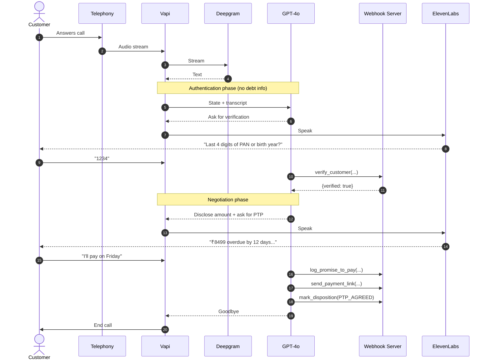

# High-Level Design – Maya Collections Voicebot

**Client:** Kapture Finance  
**Bot name:** Maya  
**Date:** August 2026

This document describes how the outbound collections voice agent works end-to-end. It’s written so another engineer can pick it up and implement or extend it.

---

## 1. Architecture & Pipeline

The call flow looks like this:

```
Customer phone
      ↓
Telephony (Vapi handles SIP / WebRTC)
      ↓
Deepgram Nova-2 (STT)
      ↓
GPT-4o (orchestrator + tool calling)
      ↓
ElevenLabs (TTS)
      ↓
Back to customer
```

Tool calls go out from the LLM to a simple webhook server I built. That server handles verification, logging promises, sending payment links, and writing the final disposition.

### Latency targets

I aimed for under 1.2 seconds total response time so the conversation doesn’t feel laggy.

| Stage                    | Target     | Notes                          |
|--------------------------|------------|--------------------------------|
| Network / telephony      | ~150-200ms | Hard to control                |
| Deepgram STT             | ~200ms     | Streaming helps a lot          |
| GPT-4o first token       | ~400ms     | Temperature 0.2 keeps it fast  |
| ElevenLabs TTS           | ~300ms     | Streaming preferred            |
| Tool call round-trip     | ~100-150ms | Depends on ngrok + server      |
| **Total**                | **< 1.2s** | Feels natural if we stay under |

### Why these providers

- **Deepgram Nova-2**: Best combination of speed and accuracy on phone audio that I found.
- **GPT-4o**: Reliable tool calling and follows instructions well when temperature is low.
- **ElevenLabs**: Voice sounded the most human out of the options available on the free tier.
- **Vapi**: Handles the telephony and tool orchestration so I didn’t have to build that layer myself.

---

## 2. Conversation State Machine

I treated the conversation as a strict state machine. The LLM is not allowed to jump ahead.

```
START
  → STATE 0: Greeting (confirm speaking to Rahul)
  → STATE 1: Authentication (ask for last 4 of PAN or birth year)
  → STATE 2: Disclosure & Negotiation (only after verify_customer succeeds)
  → STATE 3: Action (log PTP / send link / escalate)
  → STATE 4: Wrap-up (mark disposition + goodbye)
END
```

**Hard rule:** The bot is not allowed to say anything about the loan, EMI, amount, or overdue days until `verify_customer` returns `{ verified: true }`. This is enforced both in the prompt and by the fact that the disclosure language only appears after the tool succeeds.

If verification fails twice, or if it’s a wrong number, we go straight to wrap-up.

---

## 3. Intents & Entities

Main intents the bot needs to handle:

- Will pay (PTP)
- Already paid
- Cannot pay / hardship
- Dispute the amount
- Wrong person
- Do not call
- Callback request
- Hostile / abusive
- No response / silence

Entities we extract:
- `ptp_date` (string – “this Friday”, “2026-08-22”, etc.)
- `amount` (number)
- `verification_code` (string)
- `channel` (SMS / WhatsApp)
- free-text notes

---

## 4. Tools

I defined five tools. All of them hit the same webhook endpoint.

### verify_customer
Mandatory gate.  
Input: `account_id`, `verification_code`  
Output: `{ verified: true/false, customer_name?, message }`

Accepted codes for testing: `1234` or `1995`.

### log_promise_to_pay
Called when the customer commits to a date.  
Input: `account_id`, `ptp_date`, `amount`  
Returns a fake PTP ID.

### send_payment_link
Triggers a payment link.  
Input: `account_id`, `channel` (SMS / WhatsApp / BOTH)

### mark_disposition
Must be called at the end of every call.  
Possible statuses:  
`PTP_AGREED`, `ALREADY_PAID`, `DISPUTED`, `HARDSHIP_ESCALATED`, `WRONG_PERSON`, `DO_NOT_CALL`, `NO_RESPONSE`, `CALLBACK_REQUESTED`, `HOSTILE`

### escalate_to_agent
Used for disputes and hardship cases that need a human.

Full JSON schemas are in `vapi/tool_definitions.json`.

---

## 5. Auth & Data Safety

- No debt information is spoken until verification succeeds.
- If someone else answers the phone, we ask if Rahul is available. If not, we log `WRONG_PERSON` and hang up without saying anything about the account.
- Logs only store the verification code and account ID, nothing more sensitive.
- The prompt explicitly forbids inventing amounts, dates, or policies.

---

## 6. Compliance & Guardrails

- First message always discloses who is calling and from which company.
- Calling window (08:00–19:00) would be enforced at the telephony / campaign level in a real system.
- Instant opt-out: if the customer says “do not call” or “stop calling me”, we log it and end the call immediately.
- No threats, no pressure language, no unauthorized discounts.
- Temperature kept low (0.2) to reduce hallucination.

---

## 7. Edge Cases

| Situation              | How it’s handled                                      |
|------------------------|-------------------------------------------------------|
| Wrong person           | Ask if Rahul is free → if not, log WRONG_PERSON and end |
| Already paid           | Ask for mode + date, log ALREADY_PAID, mention 24-48h lag |
| Dispute                | Empathize, escalate to human                          |
| Hardship               | Empathy + escalate or offer partial if appropriate    |
| Do not call            | Log DO_NOT_CALL and hang up right away                |
| Abusive language       | One calm warning, then soft hangup if it continues    |
| Silence / voicemail    | Two re-prompts, then NO_RESPONSE                      |
| Language switch (Hindi)| Bot tries to continue in simple Hindi/Hinglish        |

---

## 8. Observability

Things I would track in production:

- Containment rate (% of calls that don’t need a human)
- PTP rate
- Auth success rate
- Average end-to-end latency
- Drop-off points (where people hang up)
- Tool call success / failure rate
- DNC rate (for compliance)

Vapi already gives transcripts and tool call logs, which is enough for debugging at this stage.

---

## 9. Architecture Diagram



---

## 10. Future improvements

If this were going into production I would:

- Replace the hard-coded customer data with a real account lookup API
- Actually send the payment link via SMS/WhatsApp
- Keep conversation state on the server instead of relying only on the LLM
- Add better Hindi support
- Build a small regression test suite using the cases in `tests/test_cases.json`
- Add sentiment detection for faster escalation on angry callers

---

That’s the design. The working prompt, tools, and server are in the rest of the repo.
